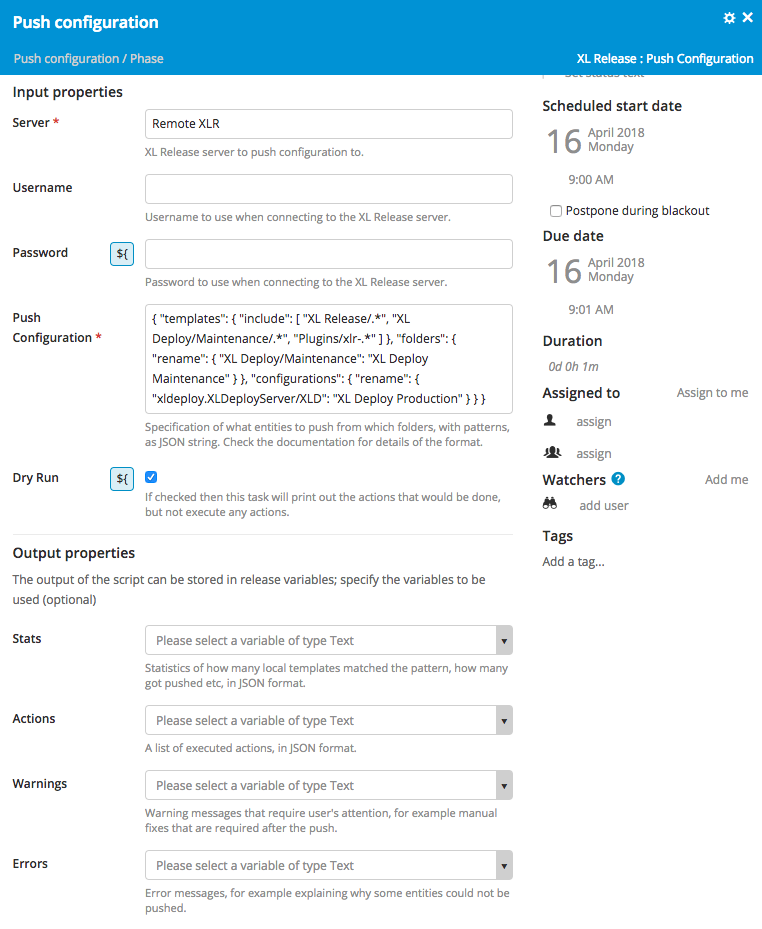

# XL Release Configuration Propagation Plugin

[![Codacy][xlr-config-propagation-plugin-codacy-image] ][xlr-config-propagation-plugin-codacy-url]
[![Code Climate][xlr-config-propagation-plugin-code-climate-image] ][xlr-config-propagation-plugin-code-climate-url]
[![License: MIT][xlr-config-propagation-plugin-license-image] ][xlr-config-propagation-plugin-license-url]
[![Github All Releases][xlr-config-propagation-plugin-downloads-image] ]()

[xlr-config-propagation-plugin-codacy-image]: https://api.codacy.com/project/badge/Grade/d45f829ce3c1462a867f12ef06500865
[xlr-config-propagation-plugin-codacy-url]: https://www.codacy.com/app/byaminov/xlr-config-propagation-plugin
[xlr-config-propagation-plugin-code-climate-image]: https://codeclimate.com/github/xebialabs-community/xlr-config-propagation-plugin/badges/gpa.svg
[xlr-config-propagation-plugin-code-climate-url]: https://codeclimate.com/github/xebialabs-community/xlr-config-propagation-plugin
[xlr-config-propagation-plugin-license-image]: https://img.shields.io/badge/License-MIT-yellow.svg
[xlr-config-propagation-plugin-license-url]: https://opensource.org/licenses/MIT
[xlr-config-propagation-plugin-downloads-image]: https://img.shields.io/github/downloads/xebialabs-community/xlr-config-propagation-plugin/total.svg

## Overview

This plugin helps you propagate parts of XL Release configuration to other XL Release instances. This can be used for example to synchronize shared folders, templates or shared configurations in a federated XL Release setup. Or it can be used to migrate specific folders to a new XL Release instance during a cleanup migration.

## Requirements

Tested to work by pushing from XL Release 8.0 to 8.0.

## Installation

Copy the plugin JAR file to the `XL_RELEASE_SERVER/plugins` directory and restart the XL Release server.

## Tasks

### XL Release: Propagate Configuration

This task pushes a subset of XL Release folders, templates and shared configurations from one XL Release instance to another. You can configure inclusion patterns of what gets copied, and you can use "dry run" option to see what gets copied before running it for real.

When the templates are imported to the remote XL Release instance the plugin makes an attempt to restore its links to shared configurations and create-release task templates. Matching between local and remote folders and shared configurations is done by titles, but it is possible to specify if a folder/configuration has a different name on the target instance.



Here is a sample specification for the Push Configuration task:
```
{
  "templates": {
    "include": [
      "XL Release/.*",
      "XL Deploy/Maintenance/.*",
      "Plugins/xlr-.*"
    ]
  },
  "folders": {
    "rename": {
      "XL Deploy/Maintenance": "XL Deploy Maintenance"
    }
  },
  "configurations": {
    "rename": {
      "xldeploy.XLDeployServer/XLD": "XL Deploy Production"
    }
  }
}
```

* The inclusion patterns are given using Python regular expression syntax. So you can specify pretty complex rules about which templates will be pushed.
* For folders you can change path on the target system: use a different name or different path for the target folder.
* For configurations you can specify a different title to use from the target system. The left part of the rename specification starts with the configuration type. 

As a result of the task execution you get the following output properties:
* `stats`: information about how many templates were found, how many of them were skipped, how many imported etc:
```
{
  "n_matched_templates": 3,
  "n_with_remote_folder": 2,
  "n_not_existing_remotely": 2,
  "n_imported": 2,
  "n_failed_import": 0
}
```
* `actions`: list of actions executed by the task, like importing templates to the remote XL Release instance: 
```
[
  {
    "description": "Import template [XL Deploy/Maintenance/Maintain XLD] to the remote instance",
    "type": "import",
    "entity": {
      "referenced_configurations": [],
      "referenced_templates": [],
      "remote_path": "XL Deploy Maintenance/Maintain XLD",
      "path": "XL Deploy/Maintenance/Maintain XLD",
      "remote_template_id": "Applications/Folderb0abb13fd10843b9890093c74a790090/Release1f86ddd57de642fbad428dc4b35eec86",
      "id": "Applications/Folder6aa860101d5c4416a7b2b5a1b79bec09/Folderfb318f8a75e4d849918b3d1634b6189/Released17da40fd91b4097a24bd78302660963",
      "remote_folder_id": "Applications/Folderb0abb13fd10843b9890093c74a790090"
    }
  }
]
```
* `warnings`: list of warning messages for the user to pay attention to, typically when a template import could be done but with some limitations.
* `errors`: list of errors occurred, e.g. when a template import fails:
```
["Missing remote folder [Plugins] for 1 matching templates"]
```


## More features to implement

There are many ideas how to make this plugin more useful, here is a listing of some of them. Contributions are welcome!

* Create target folders automatically
* Create target configurations automatically
* Push teams to the remote folders
* Update remote templates (now existing ones are skipped)
* Update remote folder teams


## Releasing

This project uses the gradle-git plugin. So you can release a new version if this project using following commands:

- to release a new patch (default): `./gradlew release -Prelease.scope=patch -Prelease.stage=final`
- to release a new minor release candidate: `./gradlew release -Prelease.scope=minor -Prelease.stage=rc`
Note that your Git repository must be clean to run any stage except for default dev.

When releasing a final version the update of this Gradle plugin will be uploaded to XebiaLabs Nexus.